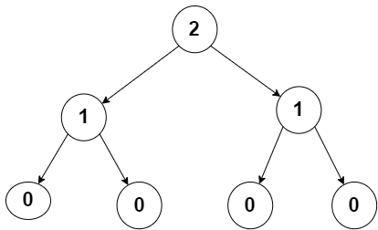

# CSP DSA with Java

## 30 Sept 2024
<!-- -------------------------------------------------- -->
### Important Patterns:-


```bash
1 2 3 4 5
1 2 3 4 5
1 2 3 4 5
1 2 3 4 5
1 2 3 4 5

----------------------

5 4 3 2 1 
5     2 
5   3 
5 4
5 

----------------------

       i  

    1 1 1 1 1
    2 2 2 2 2
 j  3 3 3 3 3
    4 4 4 4 4
    5 5 5 5 5

---------------------

Asked in Celebal
1 2 3 4 5 4 3 2 1
1     4   4     1
1   3       3   1
1 2           2 1
1               1

----------------------

print pattern of prime num
2 
3 5
7 11 13
17 19 23 29
31 37 41 43 49

----------------------

print odd nums
1 3 5 7
9 11 13 15
17 19 21 23
```

# Access Modifiers
<!-- ===================================================================================== -->
- Public  
- Private
- Protected 
- Default 


| Access Modifier | Within Class | Within Package | Subclass (Same Package) | Subclass (Different Package) | Outside Package |
|-----------------|--------------|----------------|-------------------------|------------------------------|-----------------|
| **public**      | Yes          | Yes            | Yes                     | Yes                          | Yes             |
| **protected**   | Yes          | Yes            | Yes                     | Yes                          | No              |
| **default** (no modifier) | Yes | Yes            | Yes                     | No                           | No              |
| **private**     | Yes          | No             | No                      | No                           | No              |

<!-- ------------------------------------------------------------------------------------------------------------------------------
| Access Modifier | Within Class | Within Package | Subclass (Same Package) | Subclass (Different Package) | Outside Package |
|-----------------|--------------|----------------|-------------------------|------------------------------|-----------------|
| public          | Yes          | Yes            | Yes                     | Yes                          | Yes             |
------------------------------------------------------------------------------------------------------------------------------
| private         | Yes          | No             | No                      | No                           | No              |
------------------------------------------------------------------------------------------------------------------------------
| protected       | Yes          | Yes            | Yes                     | Yes                          | No              |
------------------------------------------------------------------------------------------------------------------------------
| default         | Yes          | Yes            | Yes                     | No                           | No              |
------------------------------------------------------------------------------------------------------------------------------ -->


# importing package
<!-- ===================================================================================== -->
```bash
package filename;
import filename.classname;
```
### Example of Package is given in AccModPack Folder

# Run This by -
```bash
C:\study\CSP DSA>javac AccModPack/Package1/Person.java AccModPack/Package2/Man.java AccModPack/Main.java
C:\study\CSP DSA>java AccModPack.Main
Person's name: John
Man's name: John
```
# Inheritance
<!-- ===================================================================================== -->
- Single
- Multi Level
- Heirarchical
- Hybrid

**Multiple inheritance is not supported in java**<br>
**Interfaces are pure virtual classes while abstract classes are not**


## 1. Encapsulation
<!-- =================================================================================== -->

Encapsulation is the mechanism of wrapping the data (variables) and methods (functions) together as a single unit. It restricts direct access to some of an object’s components, which is typically done using access modifiers (like `private`).

- **Goal**: To protect the data from being accessed and modified directly from outside the class.

### Example:
```java
class Person {
    private String name;   // private variable, cannot be accessed directly

    // Getter method to access the name
    public String getName() {
        return name;
    }

    // Setter method to modify the name
    public void setName(String name) {
        this.name = name;
    }
}

public class Main {
    public static void main(String[] args) {
        Person person = new Person();
        person.setName("John");      // Setting the name using the setter method
        System.out.println(person.getName());  // Accessing the name using the getter method
    }
}
```

=============================================

Hashset doesn't maintain order while linked hashset maintain its order

when we want an ordered print of the hashset then use linked hashset

Queue : first in first out
Priority Queue: 


{
    max heap min heap, 
}


======================================

String classes in java imlpements three interfaces - 
                                                    1. Serializable
                                                    2. Comparable
                                                    3. charSequence

## Methods of Inter
| Interface        | Method                           | Description                                                           |
|------------------|----------------------------------|-----------------------------------------------------------------------|
| **Serializable** | *(None)*                         | This is a marker interface without methods.                           |
| **Comparable**   | `compareTo(To)`                  | Compares this object with another object for natural ordering.        |
| **CharSequence** | `length()`                       | Returns the number of characters in the sequence.                     |
| **CharSequence** | `charAt(int index)`              | Returns the character at the specified index.                         |
| **CharSequence** | `subSequence(int start, int end)`| Returns a subsequence from the start to end index.                    |
| **CharSequence** | `toString()`                     | Converts the sequence to a `String`.                                  |


## CharSequence:-

| Method                                   | Description                                                                                           |
|------------------------------------------|-------------------------------------------------------------------------------------------------------|
| `int length()`                           | Returns the number of characters in the sequence.                                                     |
| `char charAt(int index)`                 | Returns the character at the specified index.                                                         |
| `CharSequence subSequence(int start, int end)` | Returns a subsequence of the `CharSequence` between `start` and `end`.                               |
| `String toString()`                      | Returns a string representation of the `CharSequence`.                                                |
| `int compareTo(CharSequence another)`    | Compares this sequence lexicographically with another sequence (Java 9+).                            |
| `IntStream chars()`                      | Returns a stream of `int` values representing the characters of the sequence (Java 9+).                |
| `IntStream codePoints()`                 | Returns a stream of Unicode code points from the sequence (Java 9+).                                   |


# 7 OCT 2024
--------------------------------------------------

# Predefined Generic Classes in Java

## Set<E>

**Description:** Represents a collection that contains no duplicate elements.  
**Examples:** HashSet, LinkedHashSet, TreeSet.  
**E:** Element type.

```java
Set<Integer> set = new HashSet<>();
set.add(1);
set.add(2);
```

## Map<K, V>
**Description:** Represents a collection of key-value pairs.  
**Examples:** HashMap, TreeMap, LinkedHashMap.  
**K:** Key type, **V:** Value type.

```java
Map<String, Integer> map = new HashMap<>();
map.put("Apple", 3);
map.put("Banana", 5);
```

## Queue<E>
**Description:** Represents a collection designed for holding elements prior to processing, typically in FIFO (First-In-First-Out) order.  
**Examples:** PriorityQueue, LinkedList (implements Queue).  
**E:** Element type.

```java
Queue<String> queue = new LinkedList<>();
queue.add("First");
queue.add("Second");
```

## Stack<E>
**Description:** Represents a last-in, first-out (LIFO) stack of objects.  
**Example:** Stack.  
**E:** Element type.

```java
Stack<Integer> stack = new Stack<>();
stack.push(10);
stack.push(20);
```

## Iterator<E>
**Description:** Provides methods to iterate over any Collection<E>.  
**Examples:** Iterator in List, Set.  
**E:** Element type.

```java
List<String> list = new ArrayList<>();
list.add("A");
list.add("B");

Iterator<String> iterator = list.iterator();
while (iterator.hasNext()) {
    System.out.println(iterator.next());
}
```

## Comparable<T>
**Description:** Allows objects of a class to be compared to each other for ordering.  
**T:** Type of the object being compared.

```java
public class Student implements Comparable<Student> {
    private String name;
    private int grade;

    public Student(String name, int grade) {
        this.name = name;
        this.grade = grade;
    }

    @Override
    public int compareTo(Student other) {
        return this.grade - other.grade;
    }
}
```

## Optional<T>
**Description:** A container object which may or may not contain a non-null value.  
**T:** Type of the contained value.

```java
Optional<String> optional = Optional.of("Hello");
optional.ifPresent(System.out::println);  // Prints "Hello"
```

## Callable<V>
**Description:** Represents a task that returns a result and may throw an exception. It is similar to Runnable, but can return a result.  
**V:** Return type.

```java
Callable<Integer> task = () -> 42;
```

## Future<V>
**Description:** Represents the result of an asynchronous computation.  
**V:** Return type.

```java
Future<Integer> futureResult = executor.submit(task);
```

## Supplier<T>
**Description:** Represents a supplier of results with no input argument.  
**T:** The type of the result.

```java
Supplier<String> supplier = () -> "Hello World";
System.out.println(supplier.get()); // Prints "Hello World"
```

## Function<T, R>
**Description:** Represents a function that accepts one argument and produces a result.  
**T:** Input type, **R:** Result type.

```java
Function<Integer, String> function = (num) -> "Number is " + num;
System.out.println(function.apply(5)); // Prints "Number is 5"
```

## Summary
Generics in these predefined classes ensure that they can handle various types while maintaining type safety and avoiding ClassCastException at runtime. They help reduce code duplication and enhance code reusability.

## Clarifications on Map Usage
```java
Map<String, Integer> map = new HashMap<>();
```
**You can also that:**
```java
Map<Integer, String> map = new HashMap<>();
```

```java
Map<String, Integer> map = new HashMap<>();
```
This is perfectly valid and is a common way of writing the code.

**Explanation:**
- `Map<String, Integer>`: This specifies the types for the Map—it will hold keys of type String and values of type Integer.
- `new HashMap<>():` The diamond operator <> is used, allowing the compiler to infer the types based on the declaration on the left side.

**Example:**
```java
Map<String, Integer> map = new HashMap<>();
map.put("Apple", 3);
map.put("Banana", 5);
System.out.println(map);
```
**Output:**
```java
{Apple=3, Banana=5}
```

So yes, using the diamond operator is correct, concise, and a preferred style in modern Java.


This is a valid Syntax:
```java
Map<Integer, String> map = new HashMap<>();
```
**Explanation:**
- `Map<Integer, String>`: This specifies that the Map will use Integer as the key type and String as the value type.
- `new HashMap<>():` The diamond operator <> allows the compiler to infer the types based on the left-hand side of the declaration.

**Example:**
```java
Map<Integer, String> map = new HashMap<>();
map.put(1, "Apple");
map.put(2, "Banana");
System.out.println(map);
```
**Output:**
```java
{1=Apple, 2=Banana}
```


# Strings
---------------------------------


# Iterating Over Strings in Java

### Yes, you can iterate over a string in Java. A string in Java is essentially a sequence of characters, and you can iterate over its characters using several approaches.

## Common Ways to Iterate Over a String in Java:

### 1. Using a `for` loop with `charAt()`:

You can use a `for` loop to iterate over each character by its index using the `charAt()` method.

```java
String str = "Hello";

for (int i = 0; i < str.length(); i++) {
    System.out.println(str.charAt(i));
}
```

**Output**:

```
H
e
l
l
o
```

### 2. Using a `for-each` loop with `toCharArray()`:

You can convert the string into a character array and use an enhanced for loop (also known as a for-each loop).

```java
String str = "Hello";

for (char ch : str.toCharArray()) {
    System.out.println(ch);
}
```

**Output**:

```
H
e
l
l
o
```

### 3. Using **Stream API** (Java 8+):

You can also use the `chars()` method from the `String` class, which returns an IntStream, and then you can map or iterate over the characters.

```java
String str = "Hello";

str.chars().forEach(ch -> System.out.println((char) ch));
```

**Output**:

```
H
e
l
l
o
```

### 4. Using an `Iterator`:

If you're working with a `List<Character>`, you can convert the string to a list of characters and use an `Iterator` to traverse it.

```java
String str = "Hello";
List<Character> list = new ArrayList<>();

for (char ch : str.toCharArray()) {
    list.add(ch);
}

Iterator<Character> iterator = list.iterator();
while (iterator.hasNext()) {
    System.out.println(iterator.next());
}
```

---

# Splitting a String into Words

You can split a string into words and store them in an array in several ways in Java.

## Common Ways to Split a String into Words:

### 1. Using the `split()` method:

The `split()` method is the simplest way to break a string into words based on a delimiter (like spaces).

```java
String str = "the quick brown fox jumps over a lazy dog";
String[] words = str.split(" ");  // Split by space

for (String word : words) {
    System.out.println(word);
}
```

**Explanation**:

- The `split(" ")` splits the string by space and stores the result in a `String[]` array.

### 2. Using `StringTokenizer` (Legacy Class):

You can also use `StringTokenizer` to split a string into tokens (words), though it’s less commonly used now in modern code.

```java
import java.util.StringTokenizer;

String str = "the quick brown fox jumps over a lazy dog";
StringTokenizer tokenizer = new StringTokenizer(str, " ");

while (tokenizer.hasMoreTokens()) {
    System.out.println(tokenizer.nextToken());
}
```

**Explanation**:

- `StringTokenizer` allows you to break the string based on a specified delimiter (`" "` in this case), and you can use the `hasMoreTokens()` and `nextToken()` methods to iterate through the tokens.

---


## All String  Methods:-


| **Method**                      | **Description**                                                                                          | **Example**                                                                                                                                                    | **Output**                  |
|----------------------------------|----------------------------------------------------------------------------------------------------------|----------------------------------------------------------------------------------------------------------------------------------------------------------------|-----------------------------|
| `length()`                       | Returns the length of the string.                                                                         | `"Hello, World!".length()`                                                                                                                                     | `13`                        |
| `charAt(int index)`              | Returns the character at the specified index.                                                             | `"Hello, World!".charAt(7)`                                                                                                                                    | `W`                         |
| `substring(int beginIndex)`      | Returns a new string that is a substring starting from the specified index.                               | `"Hello, World!".substring(7)`                                                                                                                                 | `World!`                    |
| `substring(int beginIndex, int endIndex)` | Returns a new substring from beginIndex to endIndex (exclusive).                                           | `"Hello, World!".substring(0, 5)`                                                                                                                              | `Hello`                     |
| `indexOf(String str)`            | Returns the index of the first occurrence of the specified substring.                                      | `"Hello, World!".indexOf("World")`                                                                                                                             | `7`                         |
| `lastIndexOf(String str)`        | Returns the index of the last occurrence of the specified substring.                                       | `"Hello, World!".lastIndexOf("o")`                                                                                                                             | `8`                         |
| `contains(CharSequence s)`       | Checks if the string contains the specified sequence.                                                     | `"Hello, World!".contains("World")`                                                                                                                            | `true`                      |
| `equals(Object anotherString)`   | Compares two strings for equality (case-sensitive).                                                       | `"Hello".equals("hello")`                                                                                                                                      | `false`                     |
| `equalsIgnoreCase(String anotherString)` | Compares two strings for equality (case-insensitive).                                                       | `"Hello".equalsIgnoreCase("hello")`                                                                                                                            | `true`                      |
| `toUpperCase()`                  | Converts all characters of the string to uppercase.                                                       | `"Hello, World!".toUpperCase()`                                                                                                                                | `HELLO, WORLD!`             |
| `toLowerCase()`                  | Converts all characters of the string to lowercase.                                                       | `"Hello, World!".toLowerCase()`                                                                                                                                | `hello, world!`             |
| `startsWith(String prefix)`      | Checks if the string starts with the specified prefix.                                                    | `"Hello, World!".startsWith("Hello")`                                                                                                                          | `true`                      |
| `endsWith(String suffix)`        | Checks if the string ends with the specified suffix.                                                      | `"Hello, World!".endsWith("World!")`                                                                                                                           | `true`                      |
| `isEmpty()`                      | Checks if the string is empty (length = 0).                                                               | `"".isEmpty()`                                                                                                                                                 | `true`                      |
| `trim()`                         | Removes leading and trailing spaces.                                                                      | `"  Hello  ".trim()`                                                                                                                                           | `Hello`                     |
| `replace(char oldChar, char newChar)` | Replaces all occurrences of a character with a new character.                                               | `"Hello, World!".replace('l', 'p')`                                                                                                                            | `Heppo, Worpd!`             |
| `replaceAll(String regex, String replacement)` | Replaces each substring that matches the regex with the specified replacement.                                | `"Hello, World!".replaceAll("\\s", "")` (removes spaces)                                                                                                        | `Hello,World!`              |
| `split(String regex)`            | Splits the string into an array based on a specified delimiter (regex).                                   | `"Hello, World!".split(",")`                                                                                                                                   | `["Hello", " World!"]`      |
| `concat(String str)`             | Concatenates the specified string to the end of this string.                                               | `"Hello".concat(", World!")`                                                                                                                                   | `Hello, World!`             |
| `toCharArray()`                  | Converts the string into an array of characters.                                                          | `char[] chars = "Hello".toCharArray()`                                                                                                                         | `['H', 'e', 'l', 'l', 'o']` |
| `format(String format, Object... args)` | Returns a formatted string using the specified format string and arguments.                                   | `String.format("My name is %s and I am %d years old.", "Faze", 25)`                                                                                            | `My name is Faze and I am 25 years old.` |
| `compareTo(String anotherString)` | Compares two strings lexicographically (returns a negative integer, zero, or a positive integer).          | `"Hello".compareTo("World")`                                                                                                                                   | `< 0` (negative)            |
| `join(CharSequence delimiter, CharSequence... elements)` | Joins the given strings with the specified delimiter.                                                      | `String.join("-", "Hello", "World")`                                                                                                                           | `Hello-World`               |
| `matches(String regex)`          | Tells whether the string matches the given regular expression.                                            | `"12345".matches("\\d+")` (checks if the string contains only digits)                                                                                           | `true`                      |
| `intern()`                       | Returns a canonical representation for the string object.                                                 | `String a = new String("Hello").intern();`                                                                                                                     | `"Hello"`                   |
| `hashCode()`                     | Returns the hash code for the string.                                                                     | `"Hello".hashCode()`                                                                                                                                           | An integer (depends on JVM) |


# List in Java

This example demonstrates how to use a List in Java, specifically using the `ArrayList` class, which is one of the most commonly used implementations of the List interface.

## Example Code

```java
import java.util.ArrayList;
import java.util.List;

public class ListExample {
    public static void main(String[] args) {
        // Creating a List of Strings
        List<String> fruits = new ArrayList<>();

        // Adding elements to the List
        fruits.add("Apple");
        fruits.add("Banana");
        fruits.add("Orange");
        fruits.add("Mango");

        // Displaying the List
        System.out.println("Fruits List: " + fruits);

        // Accessing elements from the List
        String firstFruit = fruits.get(0); // Accessing the first element
        System.out.println("First Fruit: " + firstFruit);

        // Iterating over the List
        System.out.println("Iterating over the list:");
        for (String fruit : fruits) {
            System.out.println(fruit);
        }

        // Removing an element from the List
        fruits.remove("Banana");
        System.out.println("After removing Banana: " + fruits);

        // Checking the size of the List
        System.out.println("Size of the List: " + fruits.size());
    }
}
```

## Explanation
1. **Creating a List**: An `ArrayList` of strings is created to hold fruit names.
2. **Adding Elements**: The `add()` method is used to add elements to the list.
3. **Displaying the List**: The contents of the list are printed.
4. **Accessing Elements**: The `get()` method is used to retrieve an element at a specific index.
5. **Iterating Over the List**: A for-each loop is used to iterate through the list and print each fruit.
6. **Removing an Element**: The `remove()` method is used to remove "Banana" from the list.
7. **Getting the Size**: The `size()` method returns the number of elements in the list.

## Output
When you run the above code, you will get the following output:

```
Fruits List: [Apple, Banana, Orange, Mango]
First Fruit: Apple
Iterating over the list:
Apple
Banana
Orange
Mango
After removing Banana: [Apple, Orange, Mango]
Size of the List: 3
```

This example covers the basic operations you can perform on a List in Java.


## Removing odd nums from s list

```java
import java.util.ArrayList;
import java.util.Iterator;
import java.util.List;

public class ListOdd {
    public static void main(String[] args) {
        List<Integer> numbers = new ArrayList<>();
        numbers.add(1);
        numbers.add(2);
        numbers.add(3);
        numbers.add(4);
        numbers.add(5);
        numbers.add(6);

        System.out.println("Original List: " + numbers);

        for (int i = numbers.size() - 1; i >= 0; i--) {
            if (numbers.get(i) % 2 != 0) { // Check if the number is odd
                numbers.remove(i); // Remove the odd number
            }
        }

        // Iterator<Integer> iterator = numbers.iterator();
        // while (iterator.hasNext()) {
        //     if (iterator.next() % 2 != 0) {
        //         iterator.remove(); // Remove odd integer
        //     }
        // }

        System.out.println("List after removing odd integers: " + numbers);
    }
}
```

## Removing Prime Nums from a list

```java
import java.util.ArrayList;
import java.util.List;

public class ListPrime {

    public static boolean isPrime(int num) {
        // int divCount = 0;
        if (num <= 1) return false; 
        // int count = 0;

        for (int i = 2; i < num; i++) {
            // i*i < n
            if (num % i == 0) {
                // System.out.println("ran " + (count++));
                return false; 
                // divCount++;
            }

        }
        return true;

        // if (divCount >= 1){
        //     return false;            
        // } else{
        //     return true;
        // }
    }
    public static void main(String[] args) {
        List<Integer> numbers = new ArrayList<>();
        numbers.add(1);
        numbers.add(2);
        numbers.add(3);
        numbers.add(4);
        numbers.add(5);
        numbers.add(6);
        numbers.add(7);
        numbers.add(8);
        numbers.add(9);
        numbers.add(10);
        numbers.add(11);
        numbers.add(12);
        numbers.add(13);
        numbers.add(14);

        // numbers.add(1,7);
        // numbers.add(2,11);

        // Will not work properly if you add on indexes;

        System.out.println("Org List: " + numbers);

        for (int i = numbers.size() - 1; i >= 0; i--) {

            // System.out.println(i + " " + numbers.get(i));

            if (isPrime(numbers.get(i))) {
                numbers.remove(i); 
            }
            // we are removing element so indexes will be adjusted
            // to remove it without any problem you can start from the last to 0 index or decrement i;
        }

        System.out.println("Removed Prime: " + numbers);
    }
}


```


# Comparison between Sorting Algorithms

### Sorting algorithms arranged in ascending order of their efficiency based on the average case time complexity, along with their best, average, and worst case time complexities:


| Sorting Algorithm | Best Case Time Complexity | Average Case Time Complexity | Worst Case Time Complexity | Space Complexity |
|-------------------|---------------------------|------------------------------|----------------------------|------------------|
| **Bubble Sort**   | O(n)                      | O(n²)                       | O(n²)                     | O(1)             |
| **Selection Sort**| O(n²)                     | O(n²)                       | O(n²)                     | O(1)             |
| **Insertion Sort**| O(n)                      | O(n²)                       | O(n²)                     | O(1)             |
| **Shell Sort**    | O(n log n)               | O(n^(3/2))                  | O(n²)                     | O(1)             |
| **Quick Sort**    | O(n log n)               | O(n log n)                  | O(n²)                     | O(log n)         |
| **Merge Sort**    | O(n log n)               | O(n log n)                  | O(n log n)                | O(n)             |
| **Heap Sort**     | O(n log n)               | O(n log n)                  | O(n log n)                | O(1)             |
| **Timsort**       | O(n)                      | O(n log n)                  | O(n log n)                | O(n)             |
| **Bucket Sort**   | O(n + k)                 | O(n + k)                    | O(n²)                     | O(n)             |
| **Counting Sort** | O(n + k)                 | O(n + k)                    | O(n + k)                  | O(k)             |
| **Radix Sort**    | O(nk)                    | O(nk)                       | O(nk)                     | O(n + k)         |

### Explanation of columns:

*   **Best Case**: The time complexity when the input is in the most favorable condition (often sorted for comparison-based algorithms).
*   **Average Case**: The expected time complexity for a random input.
*   **Worst Case**: The time complexity in the worst possible scenario (e.g., completely reversed input for some algorithms).
*   **Space Complexity**: The amount of extra memory required beyond the input array.

### Key Notes:

*   **Bubble Sort**, **Selection Sort**, and **Insertion Sort** are inefficient with O(n²) complexity in average and worst cases, but Insertion Sort performs well in the best case when the array is nearly sorted.
*   **Quick Sort** is very fast on average (O(n log n)), but its worst case (O(n²)) can happen if the pivot selection is poor (this can be mitigated by choosing a random or median pivot).
*   **Merge Sort**, **Heap Sort**, and **Timsort** guarantee O(n log n) time complexity in all cases, but Merge Sort and Timsort use extra space, while Heap Sort works in-place.
*   **Radix Sort**, **Counting Sort**, and **Bucket Sort** are non-comparison sorts and can achieve linear time complexity (O(n) or O(n + k)) but only work well for specific kinds of data, such as integers or data with limited ranges.


## Main Sorts:-

```java
//Sorts - bubble, selection, insertion
import java.util.Arrays;

public class sorts {

    static void print_arr(int[] arr) {
        for (int i = 0; i < arr.length; i++) {
            System.out.print(arr[i] + " ");
        }
    }
    public static void main(String[] args) {
        int[] arr = { 5, 4, 3, 2, 1 };
        int option = 2;

        if (option == 1) {
            // bubble sort
            System.out.print("Bubble Sort : ");
            for (int i = 0; i < arr.length - 1; i++) {
                for (int j = 0; j < arr.length - i - 1; j++) {
                    if (arr[j] > arr[j + 1]) {
                        int temp = arr[j];
                        arr[j] = arr[j + 1];
                        arr[j + 1] = temp;
                    }
                
                }
            }
        } else if (option == 2) {
            // selection sort
            System.out.print("Selection Sort : ");
            for (int i = 0; i < arr.length - 1; i++) {
                int smallest = i;
                // System.out.println("Sorted Array, mat : " + Arrays.toString(arr) );
                for (int j = i + 1; j < arr.length; j++) {
                    if (arr[smallest] > arr[j]) {
                        smallest = j;
                    }
                }
                int temp = arr[smallest];
                arr[smallest] = arr[i];
                arr[i] = temp;
            }
        } else if (option == 3) {
            // insertion sort
            System.out.print("Insertion Sort : ");
            for (int i = 1; i < arr.length; i++) {
                int current = arr[i];
                int j = i - 1;

                while (j >= 0 && arr[j] > current) {
                    arr[j + 1] = arr[j];
                    j--;
                }

                arr[j + 1] = current;
            }
        } else {
            System.out.println("Set opion to valid number ");
        }

        print_arr(arr);
    }
}
```

# Merge Sort - Poster Child of Divide and Conquer

```java
import java.util.Arrays;
public class mergesort {
    public static void main(String[] args) {
        // int[] data = { 12, 19, 3, 5, 16, 1,9,0 };
        int[] data = { 4,3,2,1 };
        System.out.println("Original data:");
        printArray(data);

        mergeSort(data, 0, data.length - 1);

        System.out.print("\nSorted data : ");

        System.out.println(Arrays.toString(data));

    }

    static void mergeSort(int[] data, int start, int end) {
        if (start < end) {
            int mid = (start + end) / 2;
            // System.out.println("Start: " + start + " Mid: " + mid + " End: " + end);
            mergeSort(data, start, mid);
            mergeSort(data, mid + 1, end);
            merge(data, start, mid, end);
            
        }
    }

    static void merge(int[] data, int start, int mid, int end) {
        // System.out.println("From Merge : Start: " + start + " Mid: " + mid + " End: " + end);
        int[] temp = new int[end - start + 1];
        int i = start, j = mid + 1, k = 0;

        while (i <= mid && j <= end) {
            if (data[i] <= data[j]) {
                temp[k++] = data[i++];
            } else {
                temp[k++] = data[j++];
            }
        }

        while (i <= mid) {
            temp[k++] = data[i++];
        }
        while (j <= end) {
            temp[k++] = data[j++];
        }

        // System.out.println("Temp arr : " + Arrays.toString(temp));

        for (i = start; i <= end; i++) { 
            data[i] = temp[i - start];
            // System.out.println("I: " + i + "\n" + "Start: " + start);
        }


    }

    static void printArray(int[] data) {
        for (int value : data) {
            System.out.print(value + " ");
        }
        System.out.println();
    }
}
```


## Recursion:-

Eulid graph of recursion

Inorder 
Preorder
Postorder

Backtracking
Dynamic Programming


## Recusion (PreOrder, Inorder, PreOrder):-

```java
// import java.util.Scanner;

public class Ord {

    void ord(int n){

        if(n == 0){
            System.out.println("---------");
            return;
        }

        System.out.println("Pre: " + n);
        ord(n-1);
        System.out.println("In: " + n);
        ord(n-1);
        System.out.println("Post: " + n);
    }
    public static void main (String[] args){
        Ord t = new Ord();
        int n = 2;

        t.ord(n);
        
        // Scanner input = new Scanner(System.in);
        // input.close();
    }
}
```
Output:
```bash
Pre: 2
Pre: 1
---------
In: 1
---------
Post: 1
In: 2
Pre: 1
---------
In: 1
---------
Post: 1
Post: 2
```
### IMG of REC PIP:
> 

